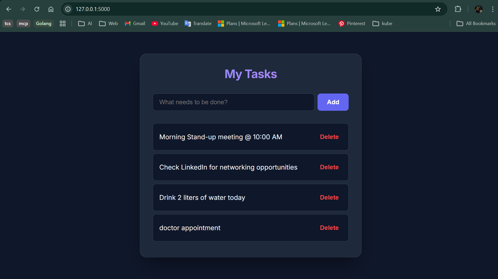

# Flask To-Do App

A lightweight task management web application built with Python Flask, deployed on AWS cloud infrastructure.

---

## Live Demo

> **URL:** `http://YOUR_EC2_PUBLIC_IP:5000`
> *(Replace with your actual EC2 public IP)*



---

## Architecture

```
                        ┌─────────────────────────────────────┐
                        │           AWS Cloud (ap-south-1)     │
                        │                                       │
  User Browser  ──────► │  ┌─────────────────────────────┐    │
  (port 5000)           │  │     EC2 Instance (t2.micro)  │    │
                        │  │     Amazon Linux 2023         │    │
                        │  │                               │    │
                        │  │   ┌───────────────────────┐  │    │
                        │  │   │   Python 3 + Flask    │  │    │
                        │  │   │   flask-todo app       │  │    │
                        │  │   │   running on :5000     │  │    │
                        │  │   └───────────────────────┘  │    │
                        │  │                               │    │
                        │  │  Security Group Rules:        │    │
                        │  │  • Port 22  (SSH access)      │    │
                        │  │  • Port 5000 (Flask app)      │    │
                        │  └─────────────────────────────┘    │
                        │                                       │
                        └─────────────────────────────────────┘
```

**Infrastructure components:**

| Component | Details |
|---|---|
| Cloud Provider | AWS (Amazon Web Services) |
| Region | ap-south-1 (Mumbai) |
| Compute | EC2 t2.micro — Amazon Linux 2023 |
| Networking | Default VPC, public subnet |
| Security | Security Group with ports 22 and 5000 |
| Runtime | Python 3, Flask 3.0.3 |
| Process management | nohup (background process) |

---

## Deployment Steps

### Prerequisites
- AWS account with EC2 access
- An EC2 key pair (.pem file)
- Python 3 and Git installed on the server

### 1. Launch EC2 Instance

```bash
# In AWS Console:
# AMI:           Amazon Linux 2023
# Instance type: t2.micro (free tier)
# Key pair:      flask-key.pem
# Security group: Allow ports 22 (SSH) and 5000 (Flask)
```

### 2. Connect to the server

```bash
# From Windows PowerShell
ssh -i flask-key.pem ec2-user@YOUR_PUBLIC_IP
```

### 3. Install dependencies on the server

```bash
sudo dnf update -y
sudo dnf install python3 python3-pip git -y
```

### 4. Clone and run the application

```bash
git clone https://github.com/Rush-28/flask-todo.git
cd flask-todo
pip3 install -r requirements.txt

# Run in background (stays alive after terminal closes)
nohup python3 app.py > app.log 2>&1 &
```

### 5. Access the application

Open a browser and navigate to:
```
http://YOUR_EC2_PUBLIC_IP:5000
```

---

## Run Locally

```bash
# Clone the repo
git clone https://github.com/Rush-28/flask-todo.git
cd flask-todo

# Install dependencies
pip install -r requirements.txt

# Start the app
python app.py
```

Visit `http://localhost:5000`

---

## Project Structure

```
flask-todo/
├── app.py              # Main Flask application
├── requirements.txt    # Python dependencies
├── README.md           # Project documentation
└── templates/
    └── index.html      # Frontend HTML template
```

---

## What I Learned

- Launching and configuring an AWS EC2 instance
- Configuring Security Groups as cloud firewalls (port-level access control)
- SSH access to a remote Linux server from Windows
- Deploying a Python web application on cloud infrastructure
- Running a process persistently in the background with `nohup`
- Managing cloud compute costs using free tier resources

---

## Tech Stack


---

## Author

Rushika 
· [GitHub](https://github.com/Rush-28)

